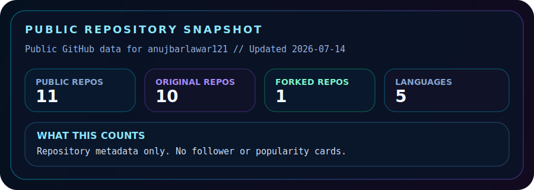
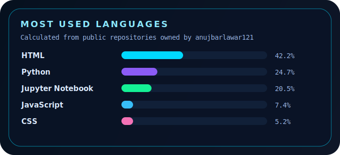
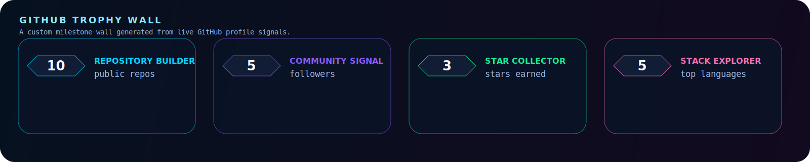
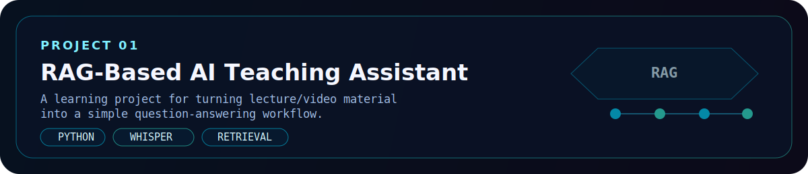
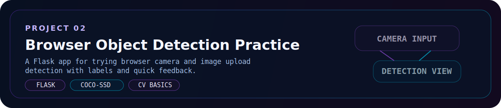
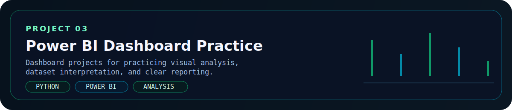
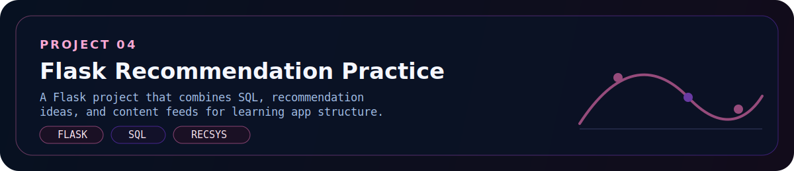
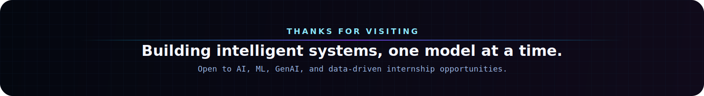

<!--
If your GitHub username is not "anujbarlawar121", replace it globally in this file before publishing.
If your Instagram or LeetCode handles change, update their links and badges below.
-->

<p align="center">
  
</p>

<p align="center">
  
</p>

<p align="center">
  
  <a href="https://github.com/anujbarlawar121">
    
  </a>
  <a href="https://in.linkedin.com/in/anuj-barlawar-4572a5290">
    
  </a>
  <a href="https://www.instagram.com/anuj_barlawar/">
    
  </a>
  <a href="https://leetcode.com/u/anuj_algo_02/">
    
  </a>
  
</p>

<h1 align="center">AI Engineer Energy. Student Hunger. Portfolio Mindset.</h1>

<p align="center">
  I am an AI and Data Science student building practical systems at the intersection of machine learning, retrieval, and product thinking.
  My goal is simple: when recruiters, founders, or engineers visit this profile, they should instantly see focus, intent, and the ability to ship.
</p>

<p align="center">
  
</p>

## About Me

```yaml
name: Anuj Barlawar
role: B.Tech Artificial Intelligence and Data Science Student
focus:
  - Artificial Intelligence
  - Data Science
  - Machine Learning
  - Generative AI
  - LLM Applications
  - RAG Systems
primary_languages:
  - Python
  - SQL
  - Java
currently_building:
  - RAG-Based AI Teaching Assistant
  - AI Chatbots
  - Data Science Projects
  - Machine Learning Projects
open_to:
  - AI / ML internships
  - GenAI collaboration
  - Learning-focused engineering environments
```

- I care about building AI systems that do more than look impressive on paper. I want them to be useful, understandable, and portfolio-ready.
- I enjoy working across the full story of a project: data, logic, retrieval, experimentation, and presentation.
- I am intentionally shaping this profile like a personal AI engineer website so it communicates clarity, ambition, and execution.

<p align="center">
  
</p>

## Current Learning

- Retrieval quality for RAG systems: chunking strategy, embeddings, context selection, and grounded response design.
- LLM application architecture: chatbot flows, memory, prompt orchestration, evaluation, and practical deployment patterns.
- Interview strength for AI / software roles: DSA in Java, cleaner Python engineering, and clearer project storytelling.

<p align="center">
  
</p>

## Tech Stack

<p align="left">
  Structured the way I actually build: languages, ML and AI libraries, GenAI systems, backend work, tools, and core applied concepts.
</p>

**Languages**

<p align="left">
  
  
  
</p>

**ML / AI**

<p align="left">
  
  
  
  
  
  
  
  
</p>

**GenAI**

<p align="left">
  
  
  
  
</p>

**Web Dev**

<p align="left">
  
  
</p>

**Tools**

<p align="left">
  
  
  
  
  
  
</p>

**Concepts**

<p align="left">
  
  
  
  
  
  
</p>

<p align="center">
  
</p>

## GitHub Intelligence

<p align="center">
  <sub>Custom GitHub API cards below refresh automatically from this repository's workflows.</sub>
</p>

<p align="center">
  
  
</p>

<p align="center">
  
</p>

<p align="center">
  
</p>

<p align="center">
  
</p>

<p align="center">
  <picture>
    <source media="(prefers-color-scheme: dark)" srcset="https://raw.githubusercontent.com/anujbarlawar121/anujbarlawar121/output/github-contribution-grid-snake-dark.svg" />
    <source media="(prefers-color-scheme: light)" srcset="https://raw.githubusercontent.com/anujbarlawar121/anujbarlawar121/output/github-contribution-grid-snake.svg" />
    
  </picture>
</p>

<p align="center">
  
</p>

## Featured Projects

<p align="center">
  
</p>

<p align="center">
  
</p>

<p align="center">
  
</p>

<p align="center">
  
</p>

<p align="center">
  Best profile impact: pin the strongest finished repositories on your GitHub profile so they reinforce these cards with real code and real results.
</p>

<p align="center">
  
</p>

## Achievements

- Portfolio focus centered on modern AI domains: RAG, chatbots, machine learning, and data science.
- Profile strategy designed to signal seriousness, taste, and execution to recruiters and internship reviewers.
- Public-facing project direction aligned with practical AI engineering rather than generic student exercises.

<p align="center">
  
</p>

## Certifications

- IBM: Databases and SQL for Data Science with Python
- AI For All: AI Appreciate Badge
- Forage: Deloitte Technology Job Simulation
- Forage: Hewlett Packard Enterprise Software Engineering Job Simulation
- Next upgrades to add here: advanced ML, deep learning, cloud, and GenAI credentials

<p align="center">
  
</p>

## LeetCode and Problem Solving

<p align="center">
  <a href="https://leetcode.com/u/anuj_algo_02/">
    
  </a>
</p>

<p align="center">
  <a href="https://leetcode.com/u/anuj_algo_02/">
    
  </a>
</p>

<p align="center">
  Live DSA signal for interview prep, consistency, and problem-solving momentum.
</p>

<p align="center">
  
</p>

## Recruiter Snapshot

- I am actively preparing for AI, ML, data science, and GenAI internship opportunities.
- My strongest project direction is in practical LLM applications, RAG systems, and machine learning workflows.
- I bring a mix of technical curiosity, visual presentation, and a clear willingness to build in public and improve fast.

<p align="center">
  If you are hiring for an AI or ML internship, LinkedIn is the fastest way to reach me, while Instagram and LeetCode show more of my builder journey and problem-solving consistency.
</p>

<p align="center">
  <a href="https://in.linkedin.com/in/anuj-barlawar-4572a5290">
    
  </a>
  <a href="https://www.instagram.com/anuj_barlawar/">
    
  </a>
  <a href="https://leetcode.com/u/anuj_algo_02/">
    
  </a>
</p>

<p align="center">
  
</p>
