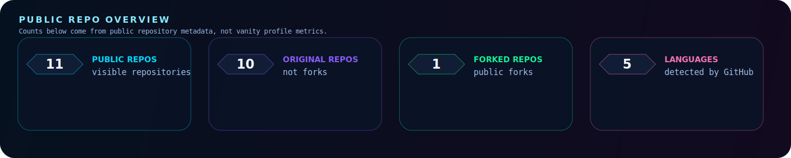

<!--
If your GitHub username is not "anujbarlawar121", replace it globally before publishing.
Keep this README factual: only list skills, projects, and certifications you can discuss in an interview.
-->

<p align="center">
  
</p>

<p align="center">
  
</p>

<p align="center">
  <a href="https://in.linkedin.com/in/anuj-barlawar-4572a5290">
    
  </a>
  <a href="https://leetcode.com/u/anuj_algo_02/">
    
  </a>
  
</p>

<h1 align="center">Third-Year AI & Data Science Student Building Small, Explainable Projects.</h1>

<p align="center">
  This profile is a practical record of what I have built, what I am learning, and what I can explain clearly in an internship interview.
</p>

<p align="center">
  
</p>

## About

```text
name: Anuj Barlawar
education: 3rd-year B.Tech, Artificial Intelligence & Data Science
current_focus: Python projects, Flask apps, SQL basics, Power BI dashboards, RAG fundamentals
currently_building: RAG-Based-Project, Flask project improvements, Power BI dashboard practice, Java DSA practice
looking_for: internships where I can contribute, learn from reviews, and build stronger engineering habits
```

I am still early in my engineering journey, so I try to keep this profile grounded.
Most of my public work is made of student projects, experiments, dashboards, and practice repositories that show how I am learning by building.

<p align="center">
  
</p>

## Current Focus

- Building small Python and Flask projects that I can run, explain, and improve.
- Practicing data analysis with notebooks and Power BI dashboards.
- Learning RAG basics through lecture transcription, chunking, retrieval, and answer generation.
- Practicing Java DSA for internship interviews.

<p align="center">
  
</p>

## Tools & Technologies

<p align="left">
  <sub>Grouped by how confidently I can discuss them today. Each item is connected to a public project, practice profile, or completed certification.</sub>
</p>

**Comfortable With**

<p align="left">
  
  
  
  
  
  
  
</p>

<p align="left">
  <sub>Evidence: <a href="https://github.com/anujbarlawar121/PDF-Merger-Python">PDF-Merger-Python</a>, <a href="https://github.com/anujbarlawar121/smart-object-detector">smart-object-detector</a>, <a href="https://github.com/anujbarlawar121/infotainment-">infotainment-</a>, <a href="https://github.com/anujbarlawar121/python-data-analysis-eda">python-data-analysis-eda</a>, <a href="https://github.com/anujbarlawar121/cars-sales-powerbi-dashboard">cars-sales-powerbi-dashboard</a>, <a href="https://github.com/anujbarlawar121/PowerBI-Weather-Dashboard">PowerBI-Weather-Dashboard</a>, and SQL coursework/certification.</sub>
</p>

**Currently Learning**

<p align="left">
  
  
  
  
  
</p>

<p align="left">
  <sub>Evidence: <a href="https://github.com/anujbarlawar121/RAG-Based-Project">RAG-Based-Project</a>, <a href="https://github.com/anujbarlawar121/python-data-analysis-eda">python-data-analysis-eda</a>, <a href="https://github.com/anujbarlawar121/infotainment-">infotainment-</a>, and <a href="https://leetcode.com/u/anuj_algo_02/">LeetCode practice</a>.</sub>
</p>

**Exploring**

<p align="left">
  
  
  
  
</p>

<p align="left">
  <sub>Evidence: <a href="https://github.com/anujbarlawar121/RAG-Based-Project">RAG-Based-Project</a>, <a href="https://github.com/anujbarlawar121/smart-object-detector">smart-object-detector</a>, and <a href="https://github.com/anujbarlawar121/infotainment-">infotainment-</a>.</sub>
</p>

<p align="center">
  
</p>

## Public GitHub Data

<p align="center">
  <sub>Generated from public GitHub repository data. I intentionally leave out follower, streak, and popularity cards here.</sub>
</p>

<p align="center">
  
  
</p>

<p align="center">
  
</p>

<p align="center">
  
</p>

<p align="center">
  <picture>
    <source media="(prefers-color-scheme: dark)" srcset="https://raw.githubusercontent.com/anujbarlawar121/anujbarlawar121/output/github-contribution-grid-snake-dark.svg" />
    <source media="(prefers-color-scheme: light)" srcset="https://raw.githubusercontent.com/anujbarlawar121/anujbarlawar121/output/github-contribution-grid-snake.svg" />
    
  </picture>
</p>

<p align="center">
  
</p>

## Featured Learning Projects

<p align="center">
  <sub>Projects I am most comfortable discussing right now: what I built, what I practiced, and what I would improve next.</sub>
</p>

<p align="center">
  
</p>

<p align="center">
  
</p>

<p align="center">
  
</p>

<p align="center">
  
</p>

| Project | What it shows | Evidence |
| --- | --- | --- |
| [RAG-Based-Project](https://github.com/anujbarlawar121/RAG-Based-Project) | Beginner RAG workflow for turning lecture videos into a simple question-answering assistant. | Python, transcription/chunking/retrieval practice, README/code history. |
| [smart-object-detector](https://github.com/anujbarlawar121/smart-object-detector) | Flask app for trying browser camera and image-upload object detection. | Flask app structure, browser UI, detection demo flow. |
| [PDF-Merger-Python](https://github.com/anujbarlawar121/PDF-Merger-Python) | Python utility project for PDF merge/extract/convert features. | Python scripting, utility-focused app behavior. |
| [infotainment-](https://github.com/anujbarlawar121/infotainment-) | Flask project with SQL schema, content feeds, and recommendation-oriented practice. | Flask, SQL basics, recommendation ideas. |
| [python-data-analysis-eda](https://github.com/anujbarlawar121/python-data-analysis-eda) | Beginner data analysis practice using Python notebooks/files. | Pandas/NumPy/Jupyter-style analysis practice. |
| [cars-sales-powerbi-dashboard](https://github.com/anujbarlawar121/cars-sales-powerbi-dashboard) and [PowerBI-Weather-Dashboard](https://github.com/anujbarlawar121/PowerBI-Weather-Dashboard) | Dashboard practice projects for visualizing business/weather datasets. | Power BI dashboards and project files. |
| [Neural_Ninjas](https://github.com/anujbarlawar121/Neural_Ninjas) | Team/project material connected to TechKruti 2k26 work. | Public repository history and project artifacts. |

<p align="center">
  
</p>

## Repository Standards I Am Working Toward

- Clear problem statement and project purpose.
- Installation or setup steps that another student can follow.
- Screenshots or short demos where the project has a UI.
- Tech stack listed with context, not just badges.
- Notes on challenges, lessons learned, and future improvements.
- Clean README structure before adding extra visuals.

<p align="center">
  
</p>

## Evidence & Accomplishments

- Built public student projects across Python, Flask, SQL basics, Power BI, data analysis, and beginner RAG experiments.
- Completed Python Bootcamp coursework through CodeWithHarry.
- Completed IBM Data Science coursework/certification.
- Completed IBM SQL coursework/certification.
- Participated in TechKruti 2k26 project work through the `Neural_Ninjas` repository.
- Practicing Java DSA through [LeetCode](https://leetcode.com/u/anuj_algo_02/); I am linking the profile without showing stats until the problem count is stronger.

<p align="center">
  
</p>

## Engineering Notes

- I prefer building small working projects before adding extra features or visuals.
- I try to document what the project does, what I learned, and what I would improve next.
- I am interested in AI engineering, data analysis, backend development, and retrieval-augmented generation, but I am still building fundamentals.
- I am currently exploring open-source contribution opportunities in beginner-friendly Python and AI repositories.

<p align="center">
  
</p>

## What I Am Looking For

I am looking for internship opportunities in AI, data analysis, Python, or backend development where I can contribute as a student, learn from code reviews, and keep improving my fundamentals through real project work.

The strongest interview topics from this profile are the repositories linked above: what I built, what decisions I made, where I got stuck, and what I would improve next.

<p align="center">
  <a href="https://in.linkedin.com/in/anuj-barlawar-4572a5290">
    
  </a>
  <a href="https://github.com/anujbarlawar121">
    
  </a>
  <a href="https://leetcode.com/u/anuj_algo_02/">
    
  </a>
</p>

<p align="center">
  
</p>
